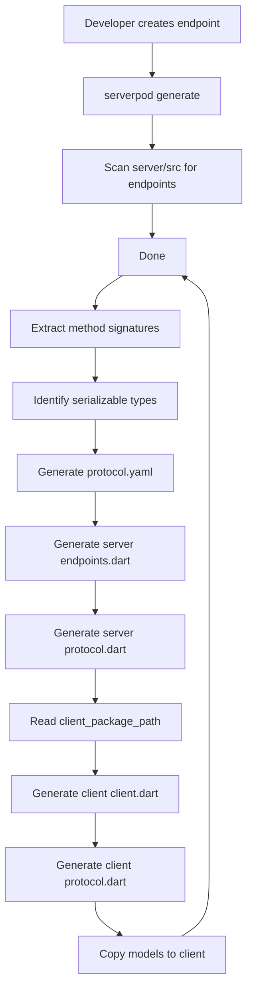

# ServerPod Code Generation Flow

## Overview

ServerPod's code generation is the **core mechanism** that enables type-safe communication between server and client. This document provides a complete understanding of how it works and how ServerPod Boost should integrate with it.

## Generation Command

```bash
# Location: Must run from server package directory
cd pilly_server
serverpod generate
```

**Version**: 3.2.3
**Binary Location**: `~/.pub-cache/bin/serverpod`

## What Gets Generated

### 1. Server-Side Generated Files

Located in: `pilly_server/lib/src/generated/`

```
generated/
├── protocol.yaml              # Protocol specification
├── protocol.dart              # Serialization manager
├── endpoints.dart             # Endpoint dispatcher
└── [feature_name]/
    └── [model].dart           # Generated models
```

#### protocol.yaml
```yaml
# Generated protocol specification
emailIdp:
  - login:
  - startRegistration:
  - verifyRegistrationCode:
  - finishRegistration:
  - startPasswordReset:
  - verifyPasswordResetCode:
  - finishPasswordReset:
jwtRefresh:
  - refreshAccessToken:
greeting:
  - hello:
```

**Purpose**: Human-readable protocol specification, used for documentation and validation.

#### endpoints.dart
```dart
class Endpoints extends EndpointDispatch {
  @override
  void initializeEndpoints(Server server) {
    var endpoints = <String, Endpoint>{
      'greeting': GreetingEndpoint()
        ..initialize(server, 'greeting', null),
      // ... other endpoints
    };
    // ... method connectors for reflection
  }
}
```

**Purpose**: Registers all endpoints and their methods for runtime dispatching.

#### protocol.dart
```dart
class Protocol extends SerializationManagerServer {
  static final List<TableDefinition> targetTableDefinitions = [
    // ... database table definitions
  ];

  @override
  T deserialize<T>(dynamic data, [Type? t]) {
    // ... deserialization logic
  }

  @override
  String getClassNameForObject(Object? data) {
    // ... class name resolution
  }
}
```

**Purpose**: Handles serialization/deserialization of data models.

### 2. Client-Side Generated Files

Located in: `pilly_client/lib/src/protocol/` (path from `generator.yaml`)

```
protocol/
├── protocol.dart              # Client serialization manager
├── client.dart                # Client endpoint methods
└── [feature_name]/
    └── [model].dart           # Generated models (mirror of server)
```

#### client.dart
```dart
class EndpointGreeting {
  final EndpointCaller caller;

  EndpointGreeting(this.caller);

  Future<Greeting> hello(String name) async {
    return caller.callServerEndpoint<Greeting>(
      'greeting',
      'hello',
      {'name': name},
    );
  }
}

// Module that exposes all endpoints
class Client {
  // ... client initialization
  EndpointGreeting get greeting => EndpointGreeting(this);
  // ... other endpoints
}
```

**Purpose**: Type-safe client methods that call server endpoints.

#### protocol.dart
```dart
class Protocol extends SerializationManager {
  @override
  T deserialize<T>(dynamic data, [Type? t]) {
    // ... client-side deserialization
  }

  static String? getClassNameForType(Type type) {
    // ... type mapping
  }
}
```

**Purpose**: Client-side serialization (matches server implementation).

## Generation Workflow

### Step-by-Step Process



### Detailed Steps

1. **Scan for Endpoints**
   - Recursively scan `lib/src/` for classes extending `Endpoint`
   - Parse each endpoint file
   - Extract public methods

2. **Parse Method Signatures**
   ```dart
   // Input
   Future<Greeting> hello(Session session, String name)
   
   // Parsed
   {
     'name': 'hello',
     'returnType': 'Greeting',
     'parameters': [
       {'name': 'session', 'type': 'Session', 'special': true},
       {'name': 'name', 'type': 'String'}
     ]
   }
   ```

3. **Identify Serializable Types**
   - Scan for classes implementing `SerializableModel`
   - Extract fields and types
   - Build type registry

4. **Generate protocol.yaml**
   - Write endpoint structure
   - Include method names
   - Document protocol

5. **Generate Server Code**
   - Create `endpoints.dart` with dispatcher
   - Create `protocol.dart` with serialization
   - Copy models to `generated/`

6. **Generate Client Code**
   - Read `client_package_path` from `config/generator.yaml`
   - Create `client.dart` with endpoint methods
   - Create `protocol.dart` with serialization
   - Copy models to `protocol/`

## Configuration: generator.yaml

Located at: `pilly_server/config/generator.yaml`

```yaml
type: server                                 # Package type

client_package_path: ../pilly_client         # WHERE TO GENERATE CLIENT CODE
server_test_tools_path: test/integration/test_tools
```

### Critical Fields

| Field | Purpose | Required |
|-------|---------|----------|
| `type` | Package type (server/client) | Yes |
| `client_package_path` | Relative path to client package | Yes |
| `server_test_tools_path` | Location for generated test tools | No |

### Path Resolution

```yaml
# If server is at: /project/pilly_server
# And config contains: client_package_path: ../pilly_client

# Client is generated at: /project/pilly_client
```

## Working With Generated Code

### DO NOT EDIT Generated Files

All files in `generated/` directories are regenerated:
- `pilly_server/lib/src/generated/**`
- `pilly_client/lib/src/protocol/**`

These files contain headers:
```dart
/* AUTOMATICALLY GENERATED CODE DO NOT MODIFY */
/*   To generate run: "serverpod generate"    */
```

### Custom Code Locations

**Server-side** (YOU EDIT THESE):
```
pilly_server/lib/src/
├── [feature]/
│   ├── [feature]_endpoint.dart     # ← Custom endpoint code
│   └── models/                      # ← Custom models (if needed)
└── generated/                       # ← DO NOT EDIT
```

**Client-side** (DO NOT EDIT):
```
pilly_client/lib/src/protocol/
└── [feature]/
    └── [model].dart                 # ← DO NOT EDIT (generated)
```

## Creating a New Endpoint

### Manual Process

1. **Create endpoint file**:
   ```bash
   touch pilly_server/lib/src/users/users_endpoint.dart
   ```

2. **Write endpoint code**:
   ```dart
   import '../generated/protocol.dart';
   import 'package:serverpod/serverpod.dart';

   class UsersEndpoint extends Endpoint {
     Future<List<User>> listUsers(Session session) async {
       return await User.find(session);
     }
   }
   ```

3. **Generate protocol**:
   ```bash
   cd pilly_server
   serverpod generate
   ```

4. **Use in Flutter**:
   ```dart
   final users = await client.users.listUsers();
   ```

### With ServerPod Boost (Future)

```bash
# Boost automates the entire process
boost create:endpoint Users --methods:list,get,create,update,delete

# This will:
# 1. Create endpoint file
# 2. Generate method stubs
# 3. Run serverpod generate
# 4. Verify output
# 5. Update protocol documentation
```

## Type Safety Flow

### Example: Greeting Endpoint

**Server** (`greeting_endpoint.dart`):
```dart
class GreetingEndpoint extends Endpoint {
  Future<Greeting> hello(Session session, String name) async {
    return Greeting(
      message: 'Hello $name',
      author: 'Serverpod',
      timestamp: DateTime.now(),
    );
  }
}
```

**Generated Client** (`client.dart`):
```dart
class EndpointGreeting {
  Future<Greeting> hello(String name) async {
    return caller.callServerEndpoint<Greeting>(
      'greeting',
      'hello',
      {'name': name},
    );
  }
}
```

**Flutter Usage**:
```dart
final greeting = await client.greeting.hello('World');
print(greeting.message);  // Type-safe!
print(greeting.author);
print(greeting.timestamp);
```

**Benefits**:
- ✅ Compile-time type checking
- ✅ IDE autocomplete
- ✅ Refactoring support
- ✅ No manual API client code
- ✅ No API documentation to maintain

## Common Generation Issues

### Issue: Client not found

```
Error: Client package not found at ../pilly_client
```

**Solution**: 
1. Check `config/generator.yaml`
2. Verify `client_package_path` is correct
3. Run `serverpod generate` again

### Issue: Method not generated

```dart
// Endpoint method is private
Future<Greeting> _hello(String name) {}  // ❌ Won't be generated

// Should be public
Future<Greeting> hello(String name) {}   // ✅ Generated
```

### Issue: Type not serializable

```dart
// Custom type without protocol
Future<MyCustomType> getData() {}  // ❌ Error

// Use serializable model
Future<MyModel> getData() {}       // ✅ Works
```

## ServerPod Boost Integration

### MCP Tool: generate-protocol

```yaml
tool: generate_protocol
description: Generate ServerPod protocol code
handler: |
  ${SERVERPOD_CLI} generate
  ${VALIDATE_PROTOCOL}
  ${REPORT_CHANGES}
  
validation:
  - check_server_package_exists
  - check_client_path_configured
  - verify_no_uncommitted_changes
  - validate_endpoint_signatures
  
output:
  - generated_files_count
  - endpoints_updated
  - models_updated
  - warnings (if any)
```

### MCP Tool: validate-before-generate

```yaml
tool: validate_protocol
description: Validate protocol before generation
handler: |
  ${SCAN_ENDPOINTS}
  ${CHECK_TYPES}
  ${VALIDATE_MODELS}
  ${REPORT_ISSUES}
  
checks:
  - endpoint_methods_are_public
  - types_are_serializable
  - no_circular_dependencies
  - client_path_exists
  - no_syntax_errors
```

### Skill: endpoint-development

```markdown
# ServerPod Endpoint Development

## Creating Endpoints

1. Create endpoint file in `lib/src/[feature]/[feature]_endpoint.dart`
2. Extend `Endpoint` class
3. Define public async methods
4. Use `Session` as first parameter
5. Return serializable types

## Example

\`\`\`dart
class MyEndpoint extends Endpoint {
  Future<MyModel> myMethod(Session session, String param) async {
    // Your code here
    return MyModel(...);
  }
}
\`\`\`

## After Creating

1. Run `serverpod generate` or use Boost's generate tool
2. Client code is automatically generated
3. Use in Flutter: `client.my.myMethod(param)`

## Best Practices

- Keep endpoints focused on single feature
- Use descriptive method names
- Return specific types, not `dynamic`
- Document complex business logic
- Handle errors appropriately
```

## Testing Generated Code

### Server Tests

```dart
// pilly_server/test/integration/test_tools/test_tools.dart
void main() {
  test('Greeting endpoint returns greeting', () async {
    final endpoint = GreetingEndpoint();
    final session = await sessionWithServer();
    
    final greeting = await endpoint.hello(session, 'World');
    
    expect(greeting.message, 'Hello World');
    expect(greeting.author, 'Serverpod');
  });
}
```

### Flutter Tests

```dart
// pilly_flutter/test/widget_test.dart
void main() {
  testWidgets('Greeting screen calls endpoint', (tester) async {
    // Mock client
    final mockClient = MockClient();
    when(mockClient.greeting.hello('Test'))
      .thenAnswer((_) async => Greeting(message: 'Hello Test'));
    
    // Test widget
    await tester.pumpWidget(MyApp(client: mockClient));
    
    // Verify
    verify(mockClient.greeting.hello('Test')).called(1);
  });
}
```

## Generation Performance

Typical generation times (Pilly project):
- Small project (<10 endpoints): ~1-2 seconds
- Medium project (10-50 endpoints): ~3-5 seconds
- Large project (50+ endpoints): ~5-10 seconds

**Optimization**: Serverpod caches previous results and only regenerates changed files.

## Summary

**Key Points**:
1. Run `serverpod generate` from server package
2. Configuration in `config/generator.yaml`
3. Client code generated to `client_package_path`
4. Never edit generated files
5. Type-safe API is automatic
6. ServerPod Boost should wrap and enhance this workflow

**Integration Strategy**:
- Wrap `serverpod generate` with validation
- Create scaffold generators for endpoints/models
- Provide pre-generation validation
- Monitor for common errors
- Automate testing after generation
